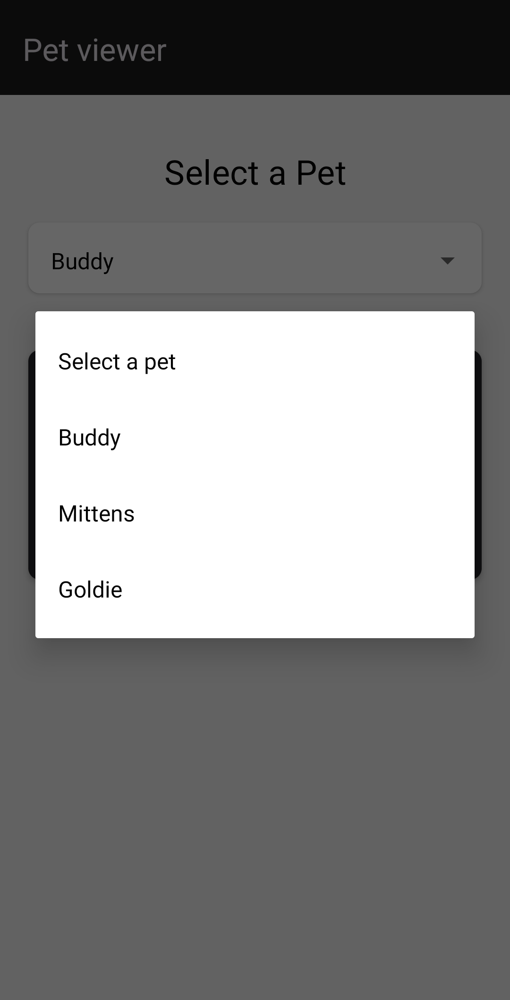

# Pet Viewer App

A simple React Native application to list pets and view details about a selected pet. This application demonstrates fetching data from a mock API, using a dropdown to select pets, and displaying detailed information using a modern UI.

## Table of Contents

- [Features](#features)
- [Prerequisites](#prerequisites)
- [Installation](#installation)
- [Running the App](#running-the-app)
- [Technologies Used](#technologies-used)
- [Screenshots](#screenshots)

## Features

- List of pets fetched from a mock API.
- Dropdown to select a pet by name.
- Display details of the selected pet, including name, type, breed, weight, and color.
- Modern UI using React Native Paper.

## Prerequisites

- Node.js and npm installed on your machine.
- Expo CLI installed globally (`npm install -g expo-cli`).

## Installation

1. Clone the repository:

   ```bash
   git clone https://github.com/zeeshan-akhter/pet-viewer-app.git
   cd pet-viewer-app
   ```

2. Install dependencies:

```bash
npm install
```

3. If you haven't already, install the Expo CLI:

```bash
npm install -g expo-cli
```

## Running the App

1. Start the development server:

```bash
expo start
```

2. Use the Expo Go app on your mobile device to scan the QR code and view the application.

## Technologies Used

- React Native: A framework for building native apps using React.
- Expo: A framework and platform for universal React applications.
- TypeScript: A typed superset of JavaScript that compiles to plain JavaScript.
- React Native Paper: A high-quality, standard-compliant Material Design library for React Native.

## Screenshots

- Screenshot 1
  
- Screenshot 2
  
- Screenshot 3
  
